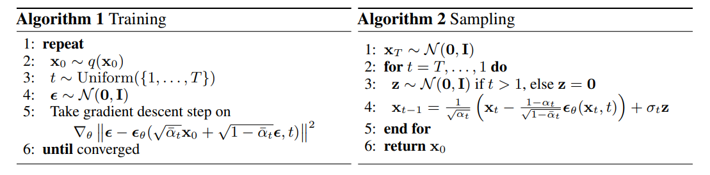

# DDPM
This project is a reproduction of [zoubouhao's](https://github.com/zoubohao/DenoisingDiffusionProbabilityModel-ddpm-) DDPM code.

To understand DDPM, I personally re-created the above project. So most of contents are from the link above.

Also i write a korean [review](https://clumsy-mustard-c19.notion.site/Diffusion-Model-c41dfaa0f67943ba81238b1d11efe2e7) of [Lil'Log](https://lilianweng.github.io/posts/2021-07-11-diffusion-models/).

If you find bugs, please tell me in the issues.

Classifier-Free Guidance and DDIM will be updated in the future...

For better understanding of DDPM, may need to review VAE and VQ-VAE(which was used in latent-diffusion).